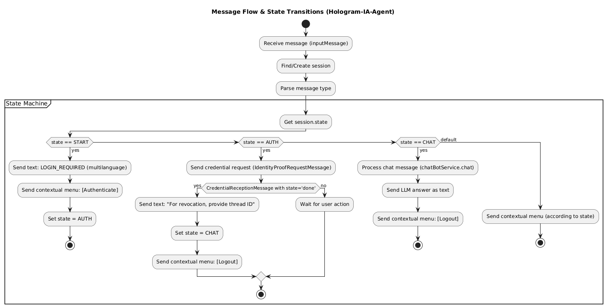

# 🤖 hologram-generic-ai-agent-vs

Welcome to **hologram-generic-ai-agent-vs** – a modular, multi-language AI agent built with NestJS, designed for welcoming users, providing personalized information, and integrating with any LLM, Retrieval Augmented Generation (RAG), and external APIs.

---

## 🚦 Environment Variables

All configuration is managed via environment variables.

**Below is a summary of all supported environment variables and their purpose:**

| Variable Name              | Description                                                                                           | Example Value / Default  |
| -------------------------- | ----------------------------------------------------------------------------------------------------- | ------------------------ |
| `APP_PORT`                 | Port on which the application runs                                                                    | `3000`                   |
| `LOG_LEVEL`                | Log level (`1=error`, `2=warn`, `3=info`, `4=debug`)                                                  | `3`                      |
| `AGENT_PROMPT`             | Defines the agent's persona and instructions                                                          | See below for example    |
| `AGENT_PACK_PATH`          | Filesystem path to the agent pack manifest (`agent-pack.yaml`); if missing, falls back to env vars    | `./agent-packs/hologram-welcome` |
| `LLM_PROVIDER`             | LLM backend: `openai`, `ollama`, `anthropic`, etc.                                                    | `ollama`                 |
| `OPENAI_API_KEY`           | API key for OpenAI (required if using OpenAI)                                                         | `sk-xxx`                 |
| `OPENAI_MODEL`             | OpenAI model to use (e.g., `gpt-3.5-turbo`, `gpt-4o-mini`)                                            | `gpt-4o-mini`            |
| `OPENAI_TEMPERATURE`       | Temperature for OpenAI completions (0-1)                                                              | `0.3`                    |
| `OPENAI_MAX_TOKENS`        | Max tokens per completion for OpenAI                                                                  | `512`                    |
| `OLLAMA_ENDPOINT`          | Ollama endpoint (use container URL if running with Docker Compose)                                    | `http://ollama:11435`    |
| `OLLAMA_MODEL`             | Ollama model to use (`llama3`, etc.)                                                                  | `llama3`                 |
| `ANTHROPIC_API_KEY`        | API key for Anthropic (Claude)                                                                        |                          |
| `RAG_PROVIDER`             | RAG backend orchestrator: `vectorstore` (custom) or `langchain`                                       | `vectorstore`            |
| `RAG_DOCS_PATH`            | Base directory for RAG documents and remote cache (`.txt`, `.md`, `.pdf`, `.csv`).                   | `/app/rag/docs`      |
| `RAG_CHUNK_SIZE`           | Max characters per document chunk during splitting (RAG)                                              | `1000`                   |
| `RAG_CHUNK_OVERLAP`        | Overlap size (characters) between consecutive chunks during splitting                                 | `200`                    |
| `RAG_REMOTE_URLS`          | Optional list of remote document URLs (CSV or JSON array). Supports `.txt`, `.md`, `.pdf`, `.csv`.   | `https://host/test.pdf,https://host/test.csv` |
| `VECTOR_STORE`             | Vector store provider for RAG: `pinecone`, `redis`                                                    | `redis`                  |
| `VECTOR_INDEX_NAME`        | Index name for both Pinecone and Redis vector stores                                                  | `hologram-ia`            |
| `PINECONE_API_KEY`         | API key for Pinecone vector store                                                                     | `pcsk_xxx`               |
| `AGENT_MEMORY_BACKEND`     | Memory backend for chat context: `memory` or `redis`                                                  | `redis`                  |
| `AGENT_MEMORY_WINDOW`      | Number of messages stored in chat memory window                                                       | `8`                      |
| `REDIS_URL`                | Redis connection URL for vector store or memory backend                                               | `redis://localhost:6379` |
| `POSTGRES_HOST`            | Hostname/IP for PostgreSQL database                                                                   | `postgres`               |
| `POSTGRES_USER`            | Username for PostgreSQL database                                                                      | `2060demo`               |
| `POSTGRES_DB_NAME`         | Database name for PostgreSQL                                                                          | `test-service-agent`     |
| `POSTGRES_PASSWORD`        | Password for PostgreSQL                                                                               | `2060demo`               |
| `CREDENTIAL_DEFINITION_ID` | Verifiable credential definition ID or URL. If omitted, the authentication menu is hidden.            | `http://localhost:3000`  |
| `VS_AGENT_ADMIN_URL`       | Service Agent Admin API URL                                                                           |                          |
| `LLM_TOOLS_CONFIG`         | Defines external tools (API integrations) available to the agent as a JSON string.                    | `[]`                     |
| `STATISTICS_API_URL`       | Base URL for the statistics API service. The agent uses this endpoint to fetch statistics via tools.  |                          |
| `STATISTICS_REQUIRE_AUTH`  | Indicates whether user authentication is required to access statistics via tools (`true` or `false`). | `false`                  |

**Example `AGENT_PROMPT`:**

```text
You are an AI agent called Karen. You welcome users and provide information about Hologram. Do not reveal you are an AI.
```

---

## 🚀 Overview

**hologram-generic-ai-agent-vs** is a backend conversational AI agent that serves as the intelligent welcoming agent for Hologram and related ecosystems. The system is designed to:

- **Send a personalized, AI-generated welcome message** when a new user connects.
- **Provide information about Hologram, Verana, and more** via natural conversation.
- **Support authentication-aware features and localizable menus** (“Authenticate” or “Logout” as appropriate, with menu titles personalized per user status). The menu is only shown when an auth credential is configured.
- **Seamlessly integrate with multiple LLMs** (OpenAI, Ollama, Anthropic) with model/content generation configurable by environment variables.
- **Retrieve contextual knowledge** from local files using RAG (Retrieval Augmented Generation) with Pinecone + LangChain integration.
- **Support session memory** (in-memory or Redis-based), so the agent can remember the context of each user’s conversation.
- **Expose a flexible tools system** for integration with APIs (e.g., statistics, user state, etc.).
- **Operate in multiple languages** (English, Spanish, French out-of-the-box; easily extendable).
- **Centralize all configuration** via `.env` and the NestJS config system.
- **Deploy with Docker Compose** including ready-to-use Redis and Ollama containers.

---

## 📦 Agent Packs (declarative config)

You can bundle all agent configuration (prompts, greeting messages, menus, RAG, tools, integrations) into a single `agent-pack.yaml` and mount it at runtime.

- Set `AGENT_PACK_PATH` to the directory containing `agent-pack.yaml` (e.g., `/app/agent-packs/hologram-welcome`).
- If the pack is missing or invalid, the app falls back to legacy environment variables.
- The manifest supports `${VAR}` placeholders resolved from `process.env`.
- Full schema and examples: [`docs/agent-pack-schema.md`](./docs/agent-pack-schema.md).

With Docker Compose/Helm, mount your pack at `/app/agent-packs/<your-pack>/agent-pack.yaml` and set `AGENT_PACK_PATH=/app/agent-packs/<your-pack>`.

---

## 🗂️ Project Structure

```sh
src/
  ├── chatbot/        # Core chatbot service, prompt logic, and session handling
  ├── llm/            # LLM provider interface + adapters (OpenAI, Ollama, Anthropic)
  ├── rag/            # RAG services (vector store, document ingestion, context retrieval)
  ├── memory/         # Memory service (in-memory/Redis backends)
  ├── common/         # Utilities, language detection, prompt templates
  ├── main.ts         # Application bootstrap
```

---

## 📝 Bot Conversation Flow Diagram

Below is a high-level flowchart representing how the `CoreService` This diagram summarizes the main states (`START`, `AUTH`, `CHAT`), how messages are handled, and what menu options are available at each step.



---

## 🐳 Running with Docker Compose

You can start the full system (API, Redis, PostgreSQL, and Service Agent) using Docker Compose:

```bash
docker compose up --build
```

This will launch:

- The AI agent backend (NestJS)
- Redis (for chat memory and Service Agent state)
- PostgreSQL (for session and agent storage)
- Service Agent (for DIDComm communication and credential handling)
- Artemis (JMS broker to use active stats)
- Stats module service
- Adminer (for browsing the PostgreSQL database)

The chatbot API will be available at [http://localhost:3000/api](http://localhost:3000/api)  
The Service Agent will be available at [http://localhost:3001](http://localhost:3001)  
Adminer UI will be accessible at [http://localhost:8080](http://localhost:8080)
The Stats module server API be available at [http://localhost:8700/q/swagger-ui](http://localhost:8700/q/swagger-ui)

### ⚙️ Environment Configuration

Before running the system, you **must create a `.env` file** in the root directory with the required environment variables.

These variables configure:

- LLM provider and API key
- Vector store (e.g., Pinecone)
- RAG configuration and document paths
- Redis and PostgreSQL credentials
- Service Agent communication settings
- Agent prompt and memory configuration

👉 Refer to the [Environment Variables](#-environment-variables) section for the full list of required variables and their purpose.

---

## 📚 API Usage

### POST `/chatbot/ask`

Request:

```json
{
  "question": "What is Hologram?",
  "connectionId": "user-123"
}
```

Response:

```json
{
  "answer": "Hologram is an advanced platform for ..."
}
```

- The agent will respond in the detected language (English, Spanish, or French) automatically.
- Session memory ensures that the context of the conversation is maintained.

## 📚 RAG (Retrieval Augmented Generation) Service Configuration

Full setup and usage instructions for the modular RAG service—including how to configure vector stores (Pinecone, Redis) and RAG providers—are provided in  
[How to use RAG Service](./docs/how-to-use-rag-service.md).

### Chunking options

- `RAG_CHUNK_SIZE` controls the maximum characters per chunk (default `1000`).
- `RAG_CHUNK_OVERLAP` controls the overlap between consecutive chunks (default `200`).
- Both `vectorstore` and `langchain` backends honor these settings through the shared document loader.

### Remote documents (optional)

- `RAG_DOCS_PATH` is both the base folder for local files and the cache root for remote downloads. Cached files live under `<RAG_DOCS_PATH>/docs`.
- Provide additional sources through `RAG_REMOTE_URLS`:
  - CSV list: `RAG_REMOTE_URLS=https://host/file1.pdf,https://host/file2.csv`
  - JSON array: `RAG_REMOTE_URLS='["https://host/file1.pdf","https://host/file2.csv"]'`
- On first run each URL is downloaded (max 50MB, 30s timeout) and reused from cache afterwards.
- Supported formats: `.txt`, `.md`, `.pdf`, `.csv`. Others are ignored.
- Both `vectorstore` and `langchain` providers use these settings under the hood via the shared loader.

## 🧠 Memory Module Setup

For a full guide on configuring and using the memory module (supporting both in-memory and Redis backends), see  
[How to use the Memory Module](./docs/how-to-use-memory-service.md).

## 📥 Ollama & Llama3 Installation

Full setup instructions for local LLMs (Ollama + Llama3) are provided in [How to use Ollama](./docs/how-to-use-ollama.md).

## 📊 Hologram-Generic JMS integration

For detailed instructions on configuring and using the JMS statistics (stats) module for real-time agent metrics with Artemis or other JMS brokers, see  
[How to use the JMS Connection Module](./docs/hologram-generic-jms-integration.md).

## 🛠️ How to Use langchain Tools

Tools allow your AI agent to interact with external APIs and services at inference time. Once defined in `LLM_TOOLS_CONFIG`, the agent can:

- Fetch live data (statistics, user info, documents, etc.)
- Trigger actions (notifications, webhooks, etc.)

You can connect external APIs as langchain "tools" to the AI agent via the `LLM_TOOLS_CONFIG` environment variable.

Each tool allows the agent to query external data sources, fetch statistics, access documentation, or trigger actions through HTTP APIs.  
**Tools are defined as a JSON array** in your `.env`, with each entry describing one tool and its options.

> **Note:** This feature is only available when using **OpenAI** or **Anthropic** as LLM provider.

**Example:**

```env
LLM_TOOLS_CONFIG=[
  {
    "name": "getLocation",
    "description": "Query location statistics by US zipcode.",
    "endpoint": "https://api.zippopotam.us/us/{query}",
    "method": "GET",
    "requiresAuth": false
  },
  {
    "name": "getStats",
    "description": "Access advanced statistics for the current user.",
    "endpoint": "https://mydomain.com/api/stats?user={query}",
    "method": "GET",
    "requiresAuth": true
  }
]
```

### Properties

- `name`: Unique tool name (no spaces).
- `description`: Clear, human-readable summary. The LLM will use this to decide when to invoke the tool.
- `endpoint`: API URL. Use `{query}` as a placeholder for the user's input.
- `method`: HTTP method, e.g. `"GET"` or `"POST"`.
- `authHeader` and `authToken`: (optional) For APIs that require authentication, specify the HTTP header and token.
- `requiresAuth`: (**new**, `true` or `false`) If set to `true`, the agent will require that the user is authenticated before invoking this tool.  
  If the user is not authenticated, the agent will respond with an appropriate message.

### How authentication works

- If a tool has `"requiresAuth": true` and the current user session is not authenticated,  
  the agent will _not_ call the tool and will reply with:  
  _"Authentication is required to access this feature. Please authenticate and try again."_
- If `"requiresAuth": false` (or omitted), the tool can be used by any user.

> **Supported LLMs:**  
> Currently, tools with dynamic HTTP integration are only available for the OpenAI and Anthropic providers.
